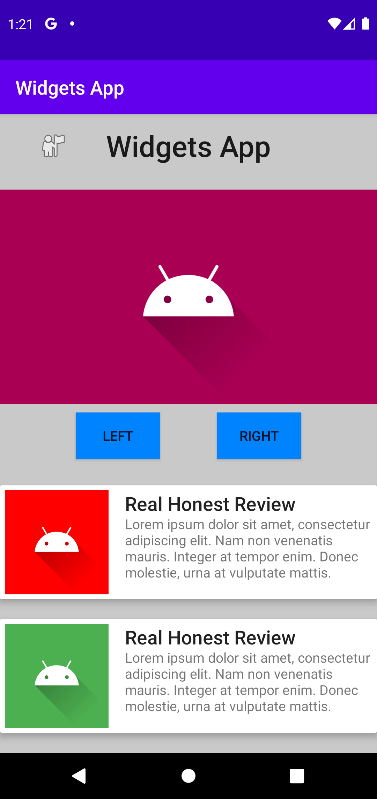

# Rapport

Det första som gjordes var att lägga till en titel. Texten gjordes via en textView och en 
guideline användes under texten för att constraina den till toppen. När titeln var på plats  
så placerades den lilla ikonen bredvid. 

Under titeln så lades det till en till större bild som constrainas mellan guidelinen under 
titeln och en ny guideline som lades till under den bilden. Kod 1 visar det. Bilden är constrainad 
via sin parent i sidled och mellan två olika guidelines på ovan- och undersidan. Guidelinen under  
bilden visas vara horisontell via "orientation" attributen och börjar 303dp ner på sidan. 

```
<ImageView
    android:id="@+id/bigImage"
    [...]
    app:layout_constraintBottom_toTopOf="@+id/underImage_guideline"
    app:layout_constraintEnd_toEndOf="parent"
    app:layout_constraintStart_toStartOf="parent"
    app:layout_constraintTop_toTopOf="@+id/title_guideline"/>

<androidx.constraintlayout.widget.Guideline
    android:id="@+id/underImage_guideline"
    [...]
    android:orientation="horizontal"
    app:layout_constraintGuide_begin="303dp" />
```
Kod 1: Stora bilden och guidelinen under den

Efter det så skulle två knappar läggas till. För att kunna constraina dem så användes 
en tredje guideline. Eftersom knapparna inte behöver supermycket plats så ligger guideslinesen 
under bilden och under knapparna nära varandra. På sidled så är knapparna constrainade mellan 
väggarna och varandra.

För att försöka få appen mer livlig så användes fler färger. En färg skapas i strings.xml filen 
med en hex-kod för vilken färg den ska vara och ett namn som är fritt. Därefter så kan färgen 
användas via android:background property:n.

Sist så gjordes ett kort via en cardView vilket visas i Kod 2. För att göra ett kort så används 
en start och en slut tag. Mellan de taggarna så skrivs allting som ska ligga i kortet. I detta 
fall så är det två stycken textView och en imageView. I kortet så används inte constraintlayout 
längre så texten flyttas runt via margins vilket inte är optimalt men är en av de enklare 
lösningarna.

```
<androidx.cardview.widget.CardView
        android:id="@+id/card1"
        [...]
        app:layout_constraintBottom_toTopOf="@id/card2"
        app:layout_constraintEnd_toEndOf="parent"
        app:layout_constraintStart_toStartOf="parent"
        app:layout_constraintTop_toBottomOf="@id/underButtons_guideline">
        <TextView
            [...]
            android:text="@string/review_title"
            android:layout_marginLeft="130dp"
            android:layout_marginTop="5dp"
            android:textAppearance="@style/TextAppearance.AppCompat.Title"/>        
        <TextView
            [...]
            android:text="@string/review_text"
            android:layout_marginLeft="130dp"
            android:layout_marginTop="30dp"/>
        <ImageView
            [...]
            android:layout_margin="5dp"
            app:srcCompat="@drawable/ic_launcher_foreground" />
</androidx.cardview.widget.CardView>
```
Kod 2: ett kort

Efter det så var det att ändra små-saker här och var för att få appen lite och lite bättre
/snyggare. Den färdiga bilden visas i bild 1


Bild 1: Färdiga appen


**Skriv din rapport här!**

_Du kan ta bort all text som finns sedan tidigare_.

## Följande grundsyn gäller dugga-svar:

- Ett kortfattat svar är att föredra. Svar som är längre än en sida text (skärmdumpar och programkod exkluderat) är onödigt långt.
- Svaret skall ha minst en snutt programkod.
- Svaret skall inkludera en kort övergripande förklarande text som redogör för vad respektive snutt programkod gör eller som svarar på annan teorifråga.
- Svaret skall ha minst en skärmdump. Skärmdumpar skall illustrera exekvering av relevant programkod. Eventuell text i skärmdumpar måste vara läsbar.
- I de fall detta efterfrågas, dela upp delar av ditt svar i för- och nackdelar. Dina för- respektive nackdelar skall vara i form av punktlistor med kortare stycken (3-4 meningar).

Programkod ska se ut som exemplet nedan. Koden måste vara korrekt indenterad då den blir lättare att läsa vilket gör det lättare att hitta syntaktiska fel.

```
function errorCallback(error) {
    switch(error.code) {
        case error.PERMISSION_DENIED:
            // Geolocation API stöds inte, gör något
            break;
        case error.POSITION_UNAVAILABLE:
            // Misslyckat positionsanrop, gör något
            break;
        case error.UNKNOWN_ERROR:
            // Okänt fel, gör något
            break;
    }
}
```

Bilder läggs i samma mapp som markdown-filen.


Läs gärna:

- Boulos, M.N.K., Warren, J., Gong, J. & Yue, P. (2010) Web GIS in practice VIII: HTML5 and the canvas element for interactive online mapping. International journal of health geographics 9, 14. Shin, Y. &
- Wunsche, B.C. (2013) A smartphone-based golf simulation exercise game for supporting arthritis patients. 2013 28th International Conference of Image and Vision Computing New Zealand (IVCNZ), IEEE, pp. 459–464.
- Wohlin, C., Runeson, P., Höst, M., Ohlsson, M.C., Regnell, B., Wesslén, A. (2012) Experimentation in Software Engineering, Berlin, Heidelberg: Springer Berlin Heidelberg.
